# PROYECTO INTEGRADOR M2: MODELADO DE DATOS Y BASES DE DATOS RELACIONALES

## 🧠 Primer Avance – Bases de datos relacionales

Esta primera pare del proyecto tiene como objetivo demostrar la configuración, modelado e integración de una base de datos relacional usando PostgreSQL y SQLAlchemy (ORM en Python), así como la limpieza y transformación de los datos para futuras tareas analíticas. Este README explica paso a paso cómo replicar el proyecto, su estructura y justificación de cada componente.

Lo siguiente descrito corresponde al **primer avance**, en el cual se establecen las bases del modelado, integración de datos y una exploración. En futuras etapas se integrarán nuevas herramientas y funcionalidades.

---

## 🌐 Configuración del Entorno de Trabajo

### 1. Requisitos previos

* Tener instalado:

  * Python >= 3.9
  * Docker y Docker Compose

### 2. Levantar la infraestructura con Docker

La conexión a la base de datos y a las herramientas auxiliares (DBT, PgAdmin, Streamlit) se realiza a través de contenedores Docker definidos en los siguientes archivos:

* `docker-compose.yml`: Define los servicios de PostgreSQL, PgAdmin, DBT y Streamlit.
* `Dockerfile`: Configura la imagen base para DBT y Streamlit.
* `.env`: Contiene las variables sensibles necesarias para la configuración.

### 3. Variables de entorno (.env)

Crea un archivo ubicado en `mi_proyecto_pg/.env`, que contenga:

- ⚠️ Importante: El archivo .env no está incluido por seguridad. Usa .env.example como plantilla y reemplaza con tus valores reales. Este archivo define las credenciales necesarias para conectarse a PostgreSQL y acceder a PgAdmin desde http://localhost:8080.

```
# Variables para PostgreSQL
POSTGRES_DB=postgres
POSTGRES_USER=admin
POSTGRES_PASSWORD=admin123

# Variables para PgAdmin (REEMPLAZAR con tus datos reales)
PGADMIN_DEFAULT_EMAIL=tu_correo@ejemplo.com
PGADMIN_DEFAULT_PASSWORD=tu_contraseña_pgadmin
```

### 4. Levantar los contenedores

Desde la terminal, en la carpeta donde está el `docker-compose.yml`:

```bash
docker-compose up --build -d
```

Esto crea y levanta:

* Una base de datos PostgreSQL
* Un PgAdmin accesible desde `http://localhost:8080`
* Un contenedor con DBT
* Un contenedor con Streamlit (usado en fases posteriores)

---

## 📁 Estructura del Proyecto

```
mi_proyecto_pg/
├── .env                         # Variables para PostgreSQL y PgAdmin
├── Dockerfile                   # Imagen para contenedor DBT
├── docker-compose.yml          # Orquestación de servicios Docker
├── PRIMER AVANCE/              # ETL, ORM, scripts, modelo
│   ├── db_conector.py
│   ├── modelos.py
│   ├── crear_tablas.py
│   ├── 1.importar_usuarios.py
│   ├── ...
│   ├── exploracion.ipynb        # se explica más adelante
│   └── DATA M2/                 # scripts .sql para extraer los datos
│       ├── 2.usuarios.sql
│       ├── 3.categorias.sql
│       ├── 4.Productos.sql
│       ├── 5.ordenes.sql
│       ├── 6.detalle_ordenes.sql
│       ├── 7.direcciones_envio.sql
│       ├── 8.carrito.sql
│       ├── 9.metodos_pago.sql
│       ├── 10.ordenes_metodospago.sql
│       ├── 11.resenas_productos.sql
│       └── 12.historial_pagos.sql
```

---

## 🚀 Paso a Paso para Ejecutar el Proyecto

### Paso 1: Crear las tablas con ORM

El archivo `crear_tablas.py` ejecuta el siguiente flujo:

1. Importa el motor de conexión (`get_db_engine`) y el modelo base `Base` desde `db_conector.py`.
2. Importa todas las clases ORM desde `modelos.py` (Usuarios, Categorias, Productos, etc.).
3. Llama a `Base.metadata.create_all(bind=engine)` para crear todas las tablas en la base de datos conectada.
4. Imprime en consola un mensaje de éxito o error.

Este enfoque asegura que las tablas estén definidas de manera centralizada y coherente con las clases Python del ORM.

**Justificación**:

* Evita errores manuales en definiciones SQL.
* Permite validar y reutilizar las estructuras en cualquier parte del código.
* Es ideal para entornos escalables y mantenibles.

### Paso 2: Importación de datos desde archivos `.sql`

Los scripts como `1.importar_usuarios.py` utilizan expresiones regulares para extraer las sentencias `INSERT INTO` desde archivos `.sql` como `DATA M2/2.usuarios.sql`. Luego:

1. Se limpia el texto (por ejemplo, eliminando acentos).
2. Se separan los valores dentro del `VALUES (...)`.
3. Se insertan fila por fila como objetos ORM en la base de datos usando `session.add()` y `session.commit()`.

**Ventajas de este enfoque**:

* Se validan tipos, claves primarias y restricciones al momento de la inserción.

### Paso 3: Verificación en PgAdmin

Una vez cargados los datos, se puede abrir `http://localhost:8080`, iniciar sesión en PgAdmin con las credenciales del archivo `.env`, y:

* Explorar visualmente las tablas creadas por SQLAlchemy.
* Navegar por los datos cargados desde los archivos `.sql`.
* Realizar queries manuales para validación y análisis preliminar.

Esta visualización es clave para asegurar que los datos están correctos, y para preparar futuros KPIs o modelos analíticos.

---

Esta parte del primer avance ya cuenta con:

* Base de datos relacional operativa en Docker.
* Tablas generadas automáticamente vía ORM.
* Datos cargados desde archivos `.sql` por scripts ETL personalizados.
* Validación visual mediante PgAdmin.

Con esta base, el proyecto está listo para avanzar hacia la exploración de los datos.

## 📊 Análisis Exploratorio y Evaluación de Calidad de Datos

El análisis exploratorio se realizó en el archivo `exploracion.ipynb`, utilizando una combinación de SQL, SQLAlchemy y herramientas gráficas en Python como pandas, seaborn y matplotlib.

### 🔍 Paso a paso del archivo `exploracion.ipynb`

1. **Conexión a la base de datos**:

   * Se importa el engine desde `db_conector.py`
   * Se valida la conexión exitosa

2. **Creación de sesión SQLAlchemy**:

   * Se crea una sesión con `sessionmaker()` para consultas ORM

3. **Carga de datos vía SQL**:

   * Se utiliza `pd.read_sql()` para obtener datos con consultas SQL
   * Se cargan tablas como `Usuarios`, `Productos`, `Carrito`, `ReseñasProductos`, `HistorialPago`

4. **Evaluación de calidad de datos**:

   * `df.isnull().sum()` para detectar nulos
   * `df.duplicated() para verificar duplicados
   * Validación de campos como emails (`@`) y precios no negativos

5. **Visualizaciones de distribución y comportamiento**:

   * Distribución de calificaciones
   * Intención de compra por mes (carrito)
   * Métodos de pago más usados
   * Monto pagado por mes registrado en el historial

6. **Extracción de insights relevantes**:

   * Producto con más unidades agregadas al carrito
   * Top usuarios por ingreso
   * Productos más costosos y con más stock

---

### ✅ Verificaciones de Calidad

Se aplicaron revisiones sistemáticas para garantizar la calidad e integridad de los datos:

* **Valores nulos**: Se usó `df.isnull().sum()` para cada tabla. **No se detectaron valores nulos** en ninguna columna clave.
* **Duplicados**: Se utilizó `df.duplicated()` y se confirmó que **no existían registros duplicados**.
* **Formato de correos electrónicos**: Se validó que todas las entradas en `Email` contuvieran el carácter `@`.
* **Valores atípicos**: Se inspeccionaron columnas como `Cantidad`, `Stock` y `MontoPagado` con estadísticos y boxplots.

> ✅ Resultado: **Los datos están en buen estado**, sin errores estructurales ni referenciales, y son adecuados para análisis, visualización y modelado posterior.

---

## 📌 Hallazgos Clave e Insights del Análisis Exploratorio

### 🎯 Producto con mayor intención de compra

* **ProductoID 25** fue el que más veces se agregó al carrito: **338 unidades**.

### 👤 Top 5 usuarios con mayor ingreso generado (ordenes Completadas):

| UsuarioID | Ingreso Total USD |
| --------- | ----------------- |
| 112       | \$5,111.83        |
| 411       | \$4,905.19        |
| 703       | \$4,424.94        |
| 390       | \$4,104.38        |
| 667       | \$4,057.64        |

Esto permite identificar a usuarios de alto valor para posibles estrategias de fidelización o segmentación personalizada.

### 💰 Top 5 productos más caros del catálogo

| Producto                   | Precio Unitario USD |
| -------------------------- | ------------------- |
| Laptop Dell Inspiron 15    | \$799.00            |
| Consola PlayStation 5      | \$549.99            |
| Smartphone Galaxy A54      | \$349.99            |
| Bicicleta Montaña Aro 29   | \$299.00            |
| Auriculares Bluetooth Sony | \$129.99            |

La tabla muestra que los productos más caros del catálogo pertenecen principalmente a la categoría de tecnología y tienen un alto valor unitario. Implementar una sección en el e-commerce que recomiende productos complementarios cuando el usuario visualice o agregue al carrito uno de los productos premium.

### 📦 Top 5 productos con más inventario disponible

| Producto                    | Unidades en Stock |
| --------------------------- | ----------------- |
| Cuaderno Universitario 100h | 300               |
| Alcohol en Gel 500ml        | 200               |
| Camiseta Básica Hombre      | 200               |
| Crema Hidratante Facial     | 150               |
| Jeans Skinny Mujer          | 150               |

Esta información es clave para estrategias de rotación de stock y campañas de liquidación.
Lanzar una campaña de promoción o liquidación dirigida a estos productos para acelerar su salida del inventario.

### 👥 Total de usuarios registrados

* Se detectaron **1,000 usuarios únicos**, lo que indica una buena base de clientes para análisis de comportamiento.

---

## 📈 Visualizaciones destacadas

* **Monto total pagado por mes**: El mes **abril** (4) fue el de mayor ingreso total con **\$469,415.61**.
* **Distribución de calificaciones**: Las evaluaciones están distribuidas de manera relativamente uniforme entre 1 y 5 estrellas.
* **Métodos de pago más utilizados**: Se observa una distribución balanceada entre todas las formas de pago, con ligera preferencia por “Crédito en tienda”.
* **Intención de compra**: Las unidades agregadas al carrito aumentaron en el mes 5, lo cual podría asociarse a promociones o estacionalidad.

Estas visualizaciones se encuentran documentadas y generadas automáticamente dentro del cuaderno `exploracion.ipynb`.

---

Con esta información, el proyecto concluye el **primer avance** con:

* Datos estructurados, cargados y validados
* Tablas limpias y sin inconsistencias
* Análisis exploratorio completo
* Hallazgos relevantes para futuras decisiones de negocio y modelado avanzado

## 🧠 Segundo Avance – Modelado de Datos Dimensional

## 📁 Estructura del Proyecto

```
MI_PROYECTO_PG/
│
├── PROYECTO M2/
│   ├── PRIMER AVANCE/
│   └── SEGUNDO AVANCE/
│       ├── Conc_Carrito.drawio.png
│       ├── Conc_DetalleOrdenes.drawio.png
│       ├── Conc_Ordenes.drawio.png
│       ├── Conc_OrdenesMetodosPago.drawio.png
│       ├── Diagrama_ER.drawio.png
│       ├── Log_Carrito.drawio.png
│       ├── Log_DetalleOrdenes.drawio.png
│       ├── Log_Ordenes.drawio.png
│       ├── Log_OrdenesMetodosPago.drawio.png
│       └── segundo_avance.ipynb
```

### 🔍 PI 1: Análisis de negocio y descubrimiento de requisitos

* Analizar las preguntas de negocio a la luz de los datos presentados en el punto anterior.
* Entender qué quiere resolver el negocio y qué datos están disponibles para ello.

Los stakeholders han definido las siguientes preguntas clave que reflejan las prioridades estratégicas del negocio:

1. **¿Cuál es la tasa de conversión de usuarios que agregan productos al carrito y concretan una compra?**
2. **¿Cuál es el ingreso generado por mes y el ingreso total acumulado?**
3. **¿Qué categoría de producto presenta mayores ingresos?**
4. **¿Qué usuario genera los mayores ingresos?**
5. **¿Cuál es la tasa de cancelación de órdenes de compra?**

---

### 📀 PI 2: Identificación de componentes del modelo dimensional

#### ✅ Hechos (medidas)

| Acción            | Hecho (Tabla de Hechos) | Medidas                  |
| ----------------- | ----------------------- | ------------------------ |
| Agregar a carrito | Carrito                 | Cantidad                 |
| Pedidos           | Ordenes                 | Total                    |
| Orden de compra   | DetalleOrdenes          | Cantidad, PrecioUnitario |
| Montos pagados    | OrdenesMetodosPago      | MontoPagado              |

#### 🌟 Dimensiones

| Dimensión   | Relación                                                                |
| ----------- | ----------------------------------------------------------------------- |
| Usuarios    | Cuál de los usuarios realiza las compras, pagos, agrega a carrito, etc. |
| Productos   | Qué productos se venden o se abandonan                                  |
| Categorías  | A qué categoría pertenecen los productos                                |
| MetodosPago | Información sobre métodos de pago                                       |

---

### 🧱 PI 3: Diseño del modelo de datos

* Se modeló una arquitectura dimensional tipo estrella siguiendo la metodologia kimball para consultas eficientes.
* Se elaboraron los siguientes diagramas:

  * `Diagrama_ER.drawio.png` (diagrama general entidad-relación).
  * `Conc_*.drawio.png`: esquemas conceptuales por tabla.
  * `Log_*.drawio.png`: esquemas lógicos por tabla.

---

### 🔀 PI 4: Slowly Changing Dimensions (SCDs)

#### Tipo 2 (mantiene historial):

* `Usuarios`: Cambios en nombre, apellido, dni, email.
* `Productos`: Cambios en precio.
* `MetodosPago`: Cambios en nombre.

#### Tipo 1 (sobrescribe):

* `Categorías`: Cambios en nombre o descripcion.

---

### 📟 PI 5: Documentación y justificación del modelo

* El modelo está alineado a las necesidades del negocio.
* Las tablas de hechos agrupan información clave para las métricas.
* Las dimensiones permiten filtros y segmentaciones ricas para análisis.
* El uso de SCD garantiza trazabilidad temporal donde es necesario.

📎 Archivos relacionados:

* 📘 Notebook: `segundo_avance.ipynb`
* 📊 Diagramas ER y por tabla: `Conc_*.drawio.png`, `Log_*.drawio.png`, `Diagrama_ER.drawio.png`

# 📊 Tercer Avance - Proyecto DBT E-commerce

Este repositorio contiene una **versión limpia y desacoplada** del modelo dimensional para un sistema de e-commerce, diseñado con DBT, integrado con PostgreSQL y preparado para visualización en Streamlit.

> ⚠️ Esta versión fue renombrada para evitar conflictos con contenedores existentes. Sigue cuidadosamente los pasos para que puedas ejecutarlo desde cero.

---

## 🧱 Estructura del Proyecto `TERCER AVANCE DBT/`

```
TERCER AVANCE DBT/
├── app/
│   └── ecommerce_project/
│       ├── dbt_project_copia.yml        # ← Renombrar a dbt_project.yml
│       ├── models/
│       │   ├── bronze/                  # Archivos de staging
│       │   ├── silver/                  # Transformaciones intermedias
│       │   └── gold/                    # Métricas, KPIs y vistas finales
│       ├── snapshots/                   # Para Slowly Changing Dimensions
│
├── dbt_profiles/
│   └── profiles_copia.yml               # ← Renombrar a profiles.yml
```

---

## 🔁 Pasos para replicar el proyecto

1. **Clona el repositorio** o copia manualmente la carpeta `TERCER AVANCE DBT/`.

2. **Renombra los archivos necesarios:**

   | Archivo/Carpeta Actual                        | Renombrar como    |
   | --------------------------------------------- | ----------------- |
   | `app/ecommerce_project/dbt_project_copia.yml` | `dbt_project.yml` |
   | `dbt_profiles/profiles_copia.yml`             | `profiles.yml`    |

3. **Abre la terminal y navega al directorio del proyecto:**

```bash
cd app/ecommerce_project
```

4. **Verifica la conexión y la configuración del entorno DBT:**

```bash
dbt debug
```

5. **Ejecuta los modelos en orden:**

```bash
dbt run
```
---

## ⚙️ Configuración del Perfil DBT (`profiles.yml`)

Este archivo debe colocarse en la carpeta `dbt_profiles/`. Contiene las credenciales necesarias para conectarse al contenedor de PostgreSQL:

```yaml
ecommerce_project:
  target: dev
  outputs:
    dev:
      type: postgres
      host: db
      user: admin
      password: admin123
      port: 5432
      dbname: EcommerceDB
      schema: public
      threads: 4
```
## 💪 Paso a paso: Implementación en DBT

### 1. **Modelo Bronze (Staging)**

* Se importaron las tablas brutas desde PostgreSQL utilizando `source.yml`.
* Se crearon archivos `.sql` por cada tabla (e.g., `stg_usuarios.sql`, `stg_productos.sql`).
* En esta capa no se alteran los datos, sólo se renombran columnas, se manejan nulos evidentes y se normaliza formato.

### 2. **Modelo Silver (Modelo dimensional)**

* Se definieron dimensiones y hechos:

  * `dim_usuarios`, `dim_productos`, `dim_metodos_pago`, `dim_categorias`
  * `fct_carrito`, `fct_ordenes`, `fct_detalleordenes`, `fct_ordenes_metodos_pago`
* Se implementaron relaciones entre tablas mediante claves foráneas.

### 3. **🔄 Implementación de Slowly Changing Dimensions (SCD)**

En este proyecto se definieron algunas dimensiones como SCD tipo 2 (Usuarios, Métodos de Pago, Productos) y tipo 1 (Categorias). Sin embargo, **durante este avance**, como aún no se habían producido cambios reales en las fuentes, la estructura generada fue la siguiente:

```sql
current_timestamp AS "FechaInicio",
NULL AS "FechaFin",
TRUE AS "Activo"
```

> Esto se realizó para simular el comportamiento de SCD hasta que se detectaran cambios.

Una vez existan cambios y se activen los snapshots, se deberá modificar a:

```sql
dbt_valid_from AS "FechaInicio",
dbt_valid_to AS "FechaFin",
dbt_current_flag AS "Activo"
```

Y también el `generate_surrogate_key` deberá incluir `"dbt_valid_from"` como parte del hash:

```sql
{{ dbt_utils.generate_surrogate_key(["MetodoPagoID", "dbt_valid_from"]) }} AS MetodoPagoSK
```

---

### 4. **Modelo Gold (KPIs e insights)**

* Se construyeron modelos agregados para responder las preguntas de negocio:

  * Ingreso mensual y acumulado
  * Tasa de conversión de carrito a compra
  * Tasa de cancelación de órdenes
  * Ingreso total por usuario
  * Ingreso total por categoría de producto

---

## 🧬 Storytelling: Insights Clave del Negocio

> 🔍 A partir de los KPIs definidos, el modelo arroja resultados que permiten tomar decisiones estratégicas:

### 1. 🌐 Tasa de conversión

* De los 996 usuarios que agregaron productos al carrito, 990 realizaron una compra.
* **Tasa de conversión: 99.4%**. Esto indica una experiencia de usuario eficiente

### 2. 📈 Ingreso acumulado por mes

* Se observa un crecimiento sostenido en los ingresos:
* **Ingreso total acumulado: \$2,752,410.34**.
* Durante el análisis de los ingresos mensuales del e-commerce, se identificaron tres meses clave con picos de ingresos:

- Agosto 2024 ($ 249,113.38)
- Abril 2025 ($ 242,874.59)
- Diciembre 2024 ($ 231,544.10)

Estos hallazgos permiten diseñar campañas más agresivas en temporadas clave, mejorar la logística en esos meses y anticiparse con estrategias de marketing estacional

### 3. 🏧 Tasa de cancelación

* De 10,000 órdenes generadas, 2,510 fueron canceladas.
* **Tasa de cancelación: 25.1%**, una cifra que merece investigación y acción para reducirla.

### 4. 🧱 Usuarios con mayores ingresos

* Usuarios como **Marcia**, **Juan José** y **Samu** han generado más de \$7,700 en ingresos individuales.
* Esto permite personalizar promociones para clientes premium.

### 5. 🛍️ Categorías más rentables

* Las categorías con mayor ingreso:

  * **Tecnología y Gadgets**
  * **Juguetes y Juegos**
  * **Videojuegos**
* Esto justifica estrategias de stock y publicidad dirigidas a esas categorías.

---

## 🔍 Conclusión

El modelo dimensional implementado con DBT permite un acceso estructurado, limpio y eficiente a los datos del e-commerce, respondiendo preguntas de negocio de forma directa y fundamentada.
✅ Este avance marca la consolidación del modelo físico y su capacidad para responder a las preguntas de negocio planteadas, sentando la base para el dashboard final en el cuarto avance.

> En el siguiente avance se documentará el modelo con `dbt docs` y se integrará la visualización con **Streamlit**.

# 📦 Cuarto Avance DBT + Streamlit

En este cuarto avance se abordan las etapas PI1, PI2 y PI3, enfocadas en la implementación de tests automáticos para validar la integridad de los datos, la generación de documentación técnica navegable con DBT, y la presentación visual de hallazgos clave mediante técnicas de storytelling con datos.

---

## 🧱 Estructura del Proyecto 
```
.
├── models/
│   ├── staging/
│   ├── silver/
│   ├── marts/
│   └── snapshots/
├── snapshots/
├── streamlit/
│   ├── app.py
│   ├── Dockerfile
│   └── requirements.txt
├── .env
├── dbt_project.yml
├── docker-compose.yml
└── README.md
```
---
## Validación y Optimización con DBT 

### Tests automáticos

Se implementaron los siguientes tests de integridad en los archivos `schema.yml`:

- **not_null** y **unique** en claves primarias (`UsuarioID`, `ProductoID`, etc.).
- **relationships** para claves foráneas como `"CategoriaID"` en la tabla Productos:
ejemplo
```yml
- name: '"CategoriaID"'
  description: Categoría a la que pertenece cada producto
  tests: 
    - not_null
    - relationships:
        to: source('src', 'Categorias')
        field: '"CategoriaID"'
```
✅ Validación de Datos con Tests Automáticos en DBT
Los tests son una herramienta esencial para asegurar la calidad de los datos y garantizar relaciones correctas entre tablas.

🧪 Tipos de tests implementados:

not_null: Verifica que los campos clave como IDs no contengan valores nulos.

unique: Asegura unicidad en identificadores.

relationships: Comprueba la integridad referencial entre claves primarias y foráneas.

📂 Implementación:
Todos los tests están definidos en los archivos schema.yml 

▶️ Ejecución:

Para correr todos los tests automáticos definidos en el proyecto:

```bash
dbt test
```
---

### Materializaciones

Se experimentó con distintas materializaciones (`view`, `table`, `incremental`). Se optó por:

- `view` para modelos de bronze.
- `table` para modelos silver y gold

## Documentación Interactiva con DBT 

La documentación fue generada con:

```bash
dbt docs generate
dbt docs serve --port 8080 --host 0.0.0.0
```
### 🧭 Visualización del Flujo de Modelos y KPIs (DBT Docs)

A continuación se presentan diagramas exportados desde DBT Docs, los cuales muestran cómo fluye la transformación de datos desde las fuentes (src) hasta los KPIs construidos en el modelo dimensional.

Estos gráficos evidencian la trazabilidad, dependencias y arquitectura modular implementada en el proyecto.

🔹 KPI: Categoría con Mayor Ingreso

<p align="center">
  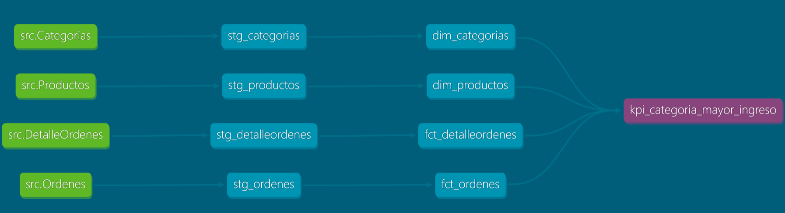
  <br><em>Figura 1. Trazabilidad del KPI de categoría con mayor ingreso</em>
</p>

🔹 KPI: Ingresos Mensuales

<p align="center"> 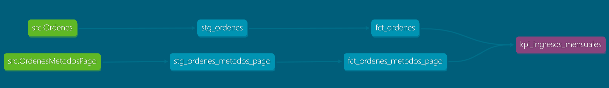 <br><em>Figura 2. Flujo de modelos para calcular los ingresos mensuales</em> </p>

🔹 KPI: Tasa de Cancelación

<p align="center">  <br><em>Figura 3. Pipeline del KPI de tasa de cancelación</em> </p>

🔹 KPI: Tasa de Conversión desde Carrito

<p align="center">  <br><em>Figura 4. Relación entre carritos y órdenes para tasa de conversión</em> </p>

🔹 KPI: Usuario con Mayor Ingreso

<p align="center"> 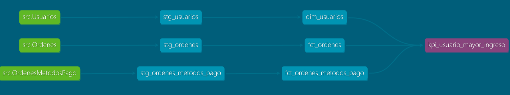 <br><em>Figura 5. Estructura de modelos para identificar al usuario con mayor ingreso</em> </p>

---

## Visualización y Storytelling con Streamlit (PI3)

### Descripción de la app

La visualización se desarrolla con Streamlit usando PostgreSQL como backend. El archivo `app.py` realiza la conexión, consulta KPIs y despliega gráficas interactivas.

#### Construcción del contenedor

Con el `Dockerfile` se ejecuta la app vía:

```bash
docker build -t streamlit_app .
docker run -p 8501:8501 streamlit_app
```

#### Requisitos

Archivo `requirements.txt`:

```
streamlit
psycopg2-binary
pandas
plotly
```

---

## KPIs Visualizados

| KPI                            | Detalle |
|-------------------------------|---------|
| Categoría con más ingreso     | 🏆 Tecnología y Gadgets, con más de \$353,783 |
| Ingresos mensuales            | Crecimiento sostenido; acumulado > \$2.7M |
| Tasa de cancelación           | 25.1%, lo que indica oportunidades de mejora |
| Tasa de conversión            | Alta eficiencia con 99.4% de usuarios con carrito que compran |
| Usuarios con mayores ingresos | Top 5 usuarios generaron más de \$37,000 en ingresos |

---

## Storytelling: Hallazgos clave

📖 Storytelling: Hallazgos Clave del Negocio
Los análisis realizados a partir del modelo dimensional y visualizados en el dashboard de Streamlit permiten identificar patrones relevantes que impactan directamente en la estrategia comercial de la tienda:

🏆 1. Tecnología domina en ingresos
La categoría Tecnología y Gadgets lidera las ventas con $353,783 generados. Este comportamiento sugiere una clara preferencia del mercado por productos tecnológicos, lo cual representa una oportunidad de expansión del catálogo y ofertas dirigidas a este segmento.

<p align="center"> 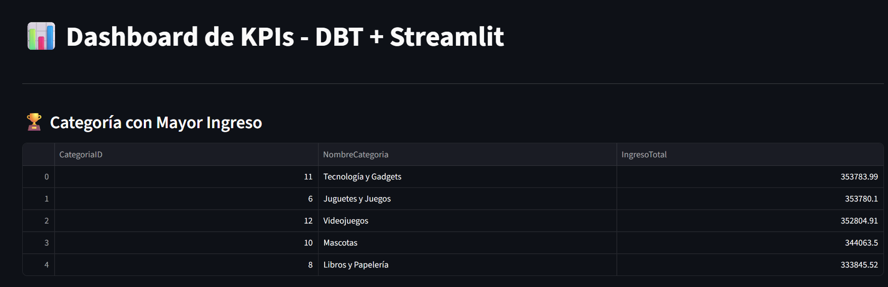 <br><em>Figura A. Tabla con ingresos por categoría</em> </p> <p align="center"> 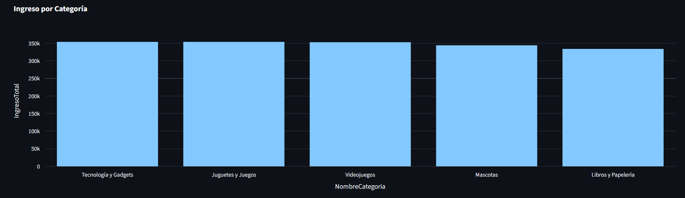 <br><em>Figura B. Gráfico de barras: ingreso total por categoría</em> </p>

📈 2. Tendencia positiva de ingresos mensuales
Los ingresos muestran un crecimiento sostenido mes a mes, con un acumulado que supera los $2.7 millones. Esta evolución sugiere una adopción creciente del canal digital, y permite proyectar escenarios de demanda futura. Se recomienda reforzar las estrategias actuales de marketing digital y promociones mensuales.

<p align="center"> 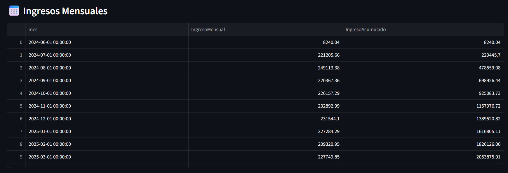 <br><em>Figura C. Tabla de ingresos mensuales por mes</em> </p> <p align="center"> 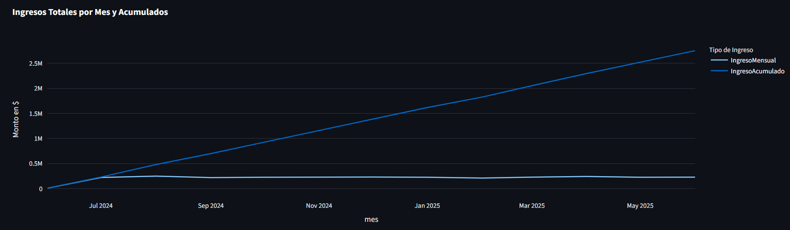 <br><em>Figura D. Gráfico de líneas con ingreso mensual y acumulado</em> </p>

🛍️ 3. Conversión casi perfecta
La tasa de conversión es excepcional: el 99.4% de los usuarios que agregan productos al carrito en estado "Completo" y "Enviado" y completan su compra. Este dato evidencia que la experiencia de usuario. Es clave mantener esta eficiencia y evitar cambios drásticos en la interfaz que puedan romper este flujo.

<p align="center"> 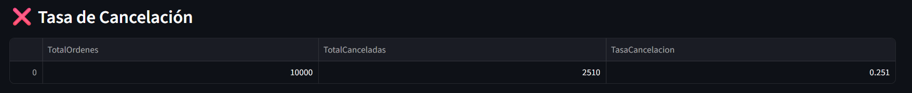 <br><em>Figura E. Tabla que muestra el número de órdenes y cancelaciones</em> </p> <p align="center"> 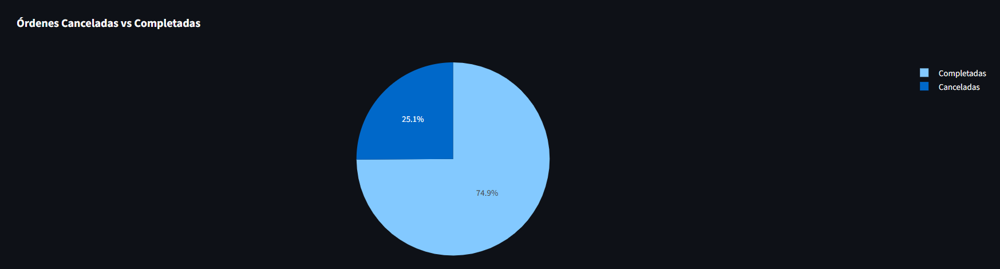 <br><em>Figura F. Visualización de la tasa de cancelación vs órdenes completadas</em> </p>

❗ 4. Riesgo latente en cancelaciones
Con una tasa de cancelación del 25.1%, existe una alerta operativa: 1 de cada 4 pedidos confirmados es cancelado posteriormente. Este dato puede deberse a problemas logísticos, falta de stock o errores en medios de pago. Se recomienda auditar el proceso post-venta para identificar y atacar las causas raíz.

<p align="center"> 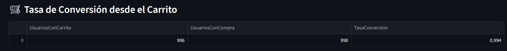 <br><em>Figura G. Tabla que incluye usuarios con carritos creados y con órdenes realizadas, finalmente cual es el porcentaje de conversión </em> </p> <p align="center"> 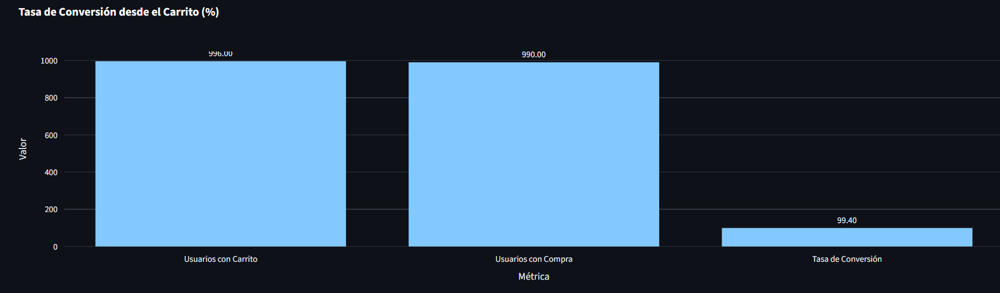 <br><em>Figura H. Visualización del porcentaje de conversión desde carrito a compra</em> </p>

🎯 5. Concentración de ingresos en pocos usuarios
El top 5 de usuarios concentra más de $37,000 en ingresos, lo que representa una oportunidad para implementar programas de fidelización, membresías premium o beneficios exclusivos que fomenten la recurrencia y retención de estos clientes clave.

<p align="center"> 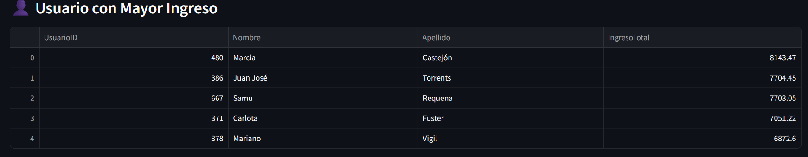 <br><em>Figura I. Tabla con los usuarios que generan mayor ingreso</em> </p> <p align="center"> 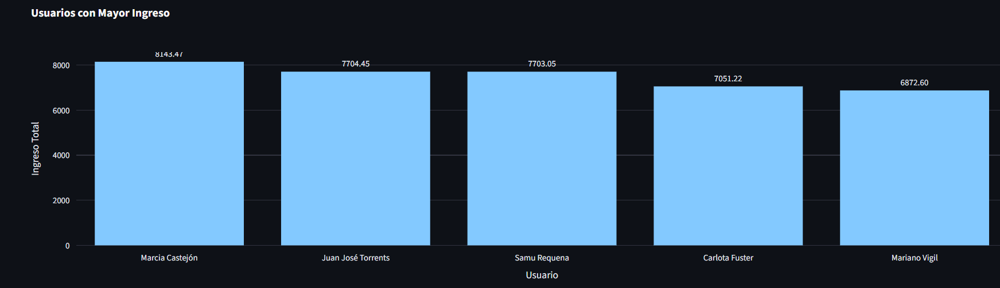 <br><em>Figura J. Gráfico de barras con ingresos por usuario</em> </p>

---

Autor: Guadalupe Ramirez  
Bootcamp Data Engineer


